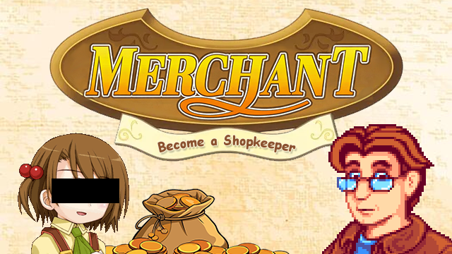

# Merchant

Open a shop, decorate it, and sell your stuff to the townsfolk!

## How to play?

To have a shop, you need a cash register (purchasable from Robin's shop) and a farm building (e.g. a Shed).

Place down the cash register in a valid farm building and interact with it to get started.

## Setting up Your Shop

To put something out for sale, place the item on a table. Make sure it can actually be reached from the entrance!

Besides having the goods, you will want to have an appealing store. This directly boosts the overall multiplier on sell prices.

This is evaluated in 2 ways:
* **Decor** is defined as any non-rug furniture, plus certain craftables (Scarecrows, Indoor Pots, Mannequins). To get full bonus on this, you should have 1 decor per table. Large furniture count for more points.
* Decor: 
